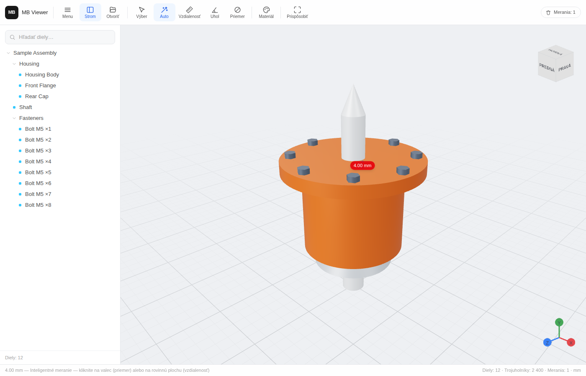

# MB Viewer

A multiplatform CAD viewer — one React codebase targeting **Web**, **Windows desktop** (Tauri) and **Android** (Capacitor).

Opens **STEP / IGES / BREP** (via OpenCASCADE compiled to WebAssembly), plus **STL / OBJ / GLB**, and provides an assembly tree, an interactive View Cube, material presets and measurement tools in a minimalist, model-first UI.



## Features

- **Project tree (left panel)** — collapsible assembly hierarchy read from the CAD product structure, with per-node show/hide and per-node **transparency** (ghost mode, strength configurable in Settings; both apply to the whole subtree), search filtering and selection sync with the viewport.
- **3D canvas + View Cube + axes** — orbit/pan/zoom viewport with an interactive navigation cube (top-right, localized bold labels; clicking faces/edges/corners smoothly animates the camera) and an **XYZ orientation triad** (bottom-right). **Perspective or parallel** (orthographic) projection, switchable in Settings.
- **Materials & appearance** — presets (*Original, Matte Plastic, Shiny Plastic, Metal, Glass*) and a color palette, applied to the whole model or to the selected part/sub-assembly (material inheritance follows the tree).
- **Measurement tools** — surface-based measuring on faces *and* feature edges: a **cylinder face or circular edge → diameter**, a **cone → apex angle**, two **flat faces → distance** (parallel, along the normal) **or angle** (non-parallel), two **straight edges → distance or angle**, plus mixed pairs (face–edge, hole axis–face, hole center–face…). The **Auto** tool does all of this from context; the dedicated **Distance / Angle / Diameter** tools bias the same picks toward their result (Diameter keeps a 3-point circle fallback for free-form meshes), and a separate **point-to-point** tool measures between two snapped points. Geometry is recovered from the tessellation (facet-normal analysis, axis fits from normal-line intersections, feature-edge chaining + line/circle fits); raycasting is BVH-accelerated (`three-mesh-bvh`).
- **Settings menu** — language (**Slovak** default / English), skin (**white / gray / black**), projection mode, transparency strength, OS **file-association** opt-ins (applied immediately on Windows via per-user registry entries — keeping existing Explorer thumbnails — and also registered by the installer), quick actions (sample assembly, grid), with Apply/Reset.
- Drag & drop or file-picker loading, adaptive ground grid, camera auto-fit with scale-aware clipping planes, built-in procedural sample assembly.

## Tech stack

| Layer | Choice |
|---|---|
| UI | React 19 + TypeScript + Vite + Tailwind CSS 4 |
| 3D | three.js via `@react-three/fiber` + `@react-three/drei` |
| CAD parsing | `occt-import-js` (OpenCASCADE → WASM) in a Web Worker |
| Picking perf | `three-mesh-bvh` |
| State | `zustand` |
| Desktop | Tauri 2 (WebView2 on Windows — ~10 MB installer, no bundled Chromium) |
| Mobile | Capacitor 8 (Android WebView) |

## How heavy STEP/IGES files are handled (WASM strategy)

STEP and IGES are **B-rep** formats — they describe exact analytic surfaces, not triangles. Turning them into something a GPU can draw requires a real CAD kernel. MB Viewer uses [OpenCASCADE](https://dev.opencascade.org/) compiled to WebAssembly (`occt-import-js`), which parses the file **and** tessellates it into triangle meshes, preserving the assembly hierarchy and colors.

The pipeline is designed around three constraints — parse times of seconds-to-minutes, a 7.6 MB WASM binary, and identical behavior across web/desktop/mobile shells:

1. **Everything runs in a Web Worker** (`public/occt-worker.js`). The UI thread never blocks: the file bytes are `postMessage`-**transferred** (zero-copy) into the worker, OpenCASCADE parses + tessellates there, and the resulting positions/normals/indices are repacked into typed arrays and **transferred** back. Even a minutes-long parse leaves orbiting, tree interaction and the progress overlay fully responsive.
2. **The WASM runtime stays out of the bundler.** The worker is a *classic* worker that `importScripts()`s the Emscripten UMD build verbatim; `scripts/copy-occt.mjs` copies `occt-import-js.{js,wasm}` into `public/vendor/occt/` on `npm install`. Vite never sees the Emscripten bundle, so dev, production, Tauri and Capacitor builds all load it the same way — and the 7.6 MB WASM is fetched **lazily**, only when the user first opens a STEP/IGES/BREP file. App startup pays nothing.
3. **Meshes arrive render-ready.** On the main thread the typed arrays are wrapped directly into `THREE.BufferGeometry` (no copying), a BVH is built once per geometry for fast raycasting, and the worker-reported node tree becomes the assembly tree. Mesh-native formats bypass the worker entirely: STL/OBJ/GLB go through the standard three.js loaders.

STL/STEP/IGES geometry is treated as **Z-up** (CAD convention) and displayed under a rigid −90° X rotation to three.js Y-up — rigid, so world-space measurements (distances/angles/diameters, in mm) are unaffected.

## Project structure

```
MB-Viewer/
├─ index.html
├─ package.json / vite.config.ts / tsconfig.json
├─ capacitor.config.ts            # Android shell config
├─ public/
│  ├─ occt-worker.js              # classic worker: OpenCASCADE WASM host
│  └─ vendor/occt/                # WASM runtime (copied on npm install, gitignored)
├─ scripts/
│  ├─ copy-occt.mjs               # node_modules → public/vendor/occt
│  ├─ icon-lib.mjs                # dependency-free icon rasterizer (shared)
│  ├─ gen-icons.mjs               # desktop icon set (PNGs + multi-size ICO)
│  └─ android-icons.mjs           # Android launcher mipmaps + adaptive icon
├─ src/
│  ├─ main.tsx                    # entry: BVH install + React root
│  ├─ app/App.tsx                 # shell: layout, drag&drop, overlays, hotkeys
│  ├─ store/viewerStore.ts        # zustand: model, tree state, tools, materials
│  ├─ core/                       # UI-independent domain logic
│  │  ├─ types.ts                 # LoadedModel, ModelNode, Measurement, …
│  │  ├─ scene.ts                 # tree traversal → render entries, world box
│  │  ├─ bvh.ts                   # three-mesh-bvh raycast install
│  │  ├─ sample.ts                # procedural demo assembly
│  │  ├─ loaders/
│  │  │  ├─ openModelFile.ts      # extension routing, file picker
│  │  │  ├─ occtLoader.ts         # worker RPC + occt result → LoadedModel
│  │  │  ├─ meshLoaders.ts        # STL / OBJ / GLB
│  │  │  └─ finalizeModel.ts      # indexing, bounds, stats, BVH build
│  │  ├─ materials/presets.ts     # presets + memoized material resolution
│  │  ├─ measure/                 # surface/edge classification + pairing math
│  │  ├─ desktop.ts               # Tauri glue: launch files, associations
│  │  └─ mobile.ts                # Capacitor glue: fullscreen (status bar)
│  └─ components/
│     ├─ layout/                  # Toolbar, Sidebar (assembly tree), StatusBar
│     ├─ viewport/                # Canvas, SceneModel, ViewCube, CameraRig,
│     │                           # MeasureOverlay, StudioEnvironment, grid
│     └─ ui/icons.tsx             # inline SVG icon set
└─ src-tauri/                     # Windows/desktop shell (Tauri 2)
   ├─ tauri.conf.json / Cargo.toml
   └─ src/{main.rs, lib.rs,       # launch-file commands, single instance,
           associations.rs}       # runtime file associations (HKCU registry)
```

## Getting started

```bash
npm install        # also copies the occt WASM runtime into public/
npm run dev        # web app on http://localhost:5173
npm run build      # typecheck + production bundle in dist/
```

No model at hand? Click **Sample** in the toolbar.

### Windows desktop (Tauri)

Requires [Rust](https://rustup.rs) and the [Tauri prerequisites](https://tauri.app/start/prerequisites/) (WebView2 is preinstalled on Windows 11).

```bash
npm run desktop:dev      # dev app with hot reload
npm run desktop:build    # installer (NSIS/MSI) in src-tauri/target/release/bundle/
```

App icons are committed and reproducible via `npm run icons` (`scripts/gen-icons.mjs` renders the branding with no image dependencies). Double-clicking a file associated with MB Viewer opens it directly; when the app is already running, the file is routed into the existing window (single-instance).

### Android (Capacitor)

Requires Android Studio + SDK.

```bash
npx cap add android      # once — generates the android/ project (gitignored)
npm run android:sync     # build web assets + sync into the native project
npm run android:open     # open in Android Studio, run on device/emulator
```

## CI installer builds

`.github/workflows/build.yml` is a manually triggered workflow (**Actions → Build installers → Run workflow**) with a platform picker (`all` / `android` / `windows`). The **Android** job generates the Capacitor project and produces a debug **`.apk`**; the **Windows** job compiles the Tauri shell and produces an **`.msi`**. Both are uploaded as downloadable artifacts on the run's Summary page.

## Notes & roadmap

- Units are assumed **millimeters** (OpenCASCADE normalizes STEP/IGES lengths to mm on import).
- On free-form meshes (organic STL sculpts) the surface classifiers stay quiet — use the 3-point diameter fallback and the point-to-point tool there.
- Windows may protect a user-chosen default app (`UserChoice`): MB Viewer then still appears in the extension's **Open with** list, and becomes the default where none was set.
- `.glb` should be self-contained and uncompressed (no Draco/KTX2 decoders wired up yet); multi-material meshes use their first material.
- Ideas next: per-face colors from STEP (`brep_faces` is already delivered by the worker), section planes, exploded views, edge/silhouette rendering.

## License

MIT — see [LICENSE](LICENSE).
